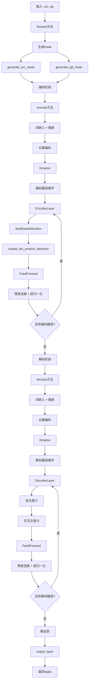
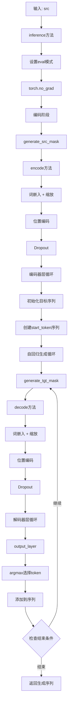
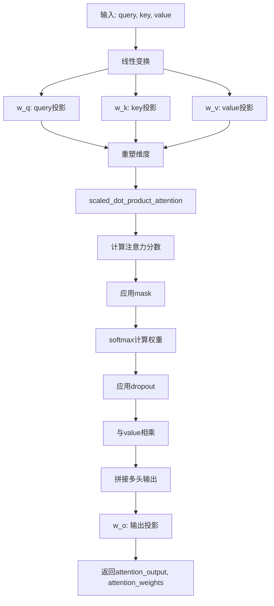
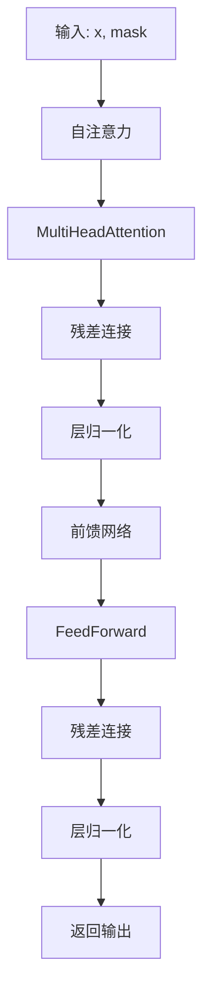
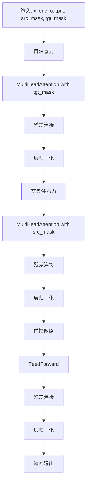

# Transformer 代码执行顺序图

## 1. 训练模式执行流程



## 2. 推理模式执行流程



## 3. 详细组件执行顺序

### 3.1 MultiHeadAttention 执行流程



### 3.2 EncoderLayer 执行流程



### 3.3 DecoderLayer 执行流程



## 4. 关键方法调用链

### 4.1 训练时完整调用链

```
model.forward(src, tgt)
├── generate_src_mask(src)
├── generate_tgt_mask(tgt)
├── encode(src, src_mask)
│   ├── src_embedding(src) * sqrt(d_model)
│   ├── positional_encoding(src)
│   ├── dropout(src)
│   └── encoder_layers循环
│       └── EncoderLayer.forward(x, mask)
│           ├── MultiHeadAttention.forward(x, x, x, mask)
│           │   ├── scaled_dot_product_attention(Q, K, V, mask)
│           │   └── w_o(attention_output)
│           ├── FeedForward.forward(x)
│           └── LayerNorm + 残差连接
├── decode(tgt, enc_output, src_mask, tgt_mask)
│   ├── tgt_embedding(tgt) * sqrt(d_model)
│   ├── positional_encoding(tgt)
│   ├── dropout(tgt)
│   └── decoder_layers循环
│       └── DecoderLayer.forward(x, enc_output, src_mask, tgt_mask)
│           ├── 自注意力 (MultiHeadAttention)
│           ├── 交叉注意力 (MultiHeadAttention)
│           └── FeedForward
└── output_layer(dec_output)
```

### 4.2 推理时完整调用链

```
model.inference(src)
├── generate_src_mask(src)
├── encode(src, src_mask)  # 同训练时
├── 初始化 tgt = [start_token]
└── 自回归循环:
    ├── generate_tgt_mask(tgt)
    ├── decode(tgt, enc_output, src_mask, tgt_mask)  # 同训练时
    ├── output_layer(dec_output[:, -1:, :])
    ├── argmax选择next_token
    ├── torch.cat([tgt, next_token], dim=1)
    └── 检查结束条件
```

## 5. 数据流转换

### 5.1 张量形状变化

```
输入: src [batch_size, src_len], tgt [batch_size, tgt_len]

词嵌入后: [batch_size, seq_len, d_model]
位置编码后: [batch_size, seq_len, d_model] (形状不变，内容变化)

多头注意力内部:
- 线性变换: [batch_size, seq_len, d_model]
- 重塑: [batch_size, num_heads, seq_len, d_k]
- 注意力计算: [batch_size, num_heads, seq_len, seq_len]
- 拼接: [batch_size, seq_len, d_model]

输出: [batch_size, tgt_len, tgt_vocab_size]
```

### 5.2 关键计算步骤

1. **注意力分数计算**: `Q * K^T / sqrt(d_k)`
2. **注意力权重**: `softmax(scores)`
3. **注意力输出**: `attention_weights * V`
4. **残差连接**: `x + sublayer(x)`
5. **层归一化**: `LayerNorm(x + sublayer(x))`

这个执行顺序图展示了Transformer从输入到输出的完整数据流，包括训练和推理两种模式下的详细执行路径。 