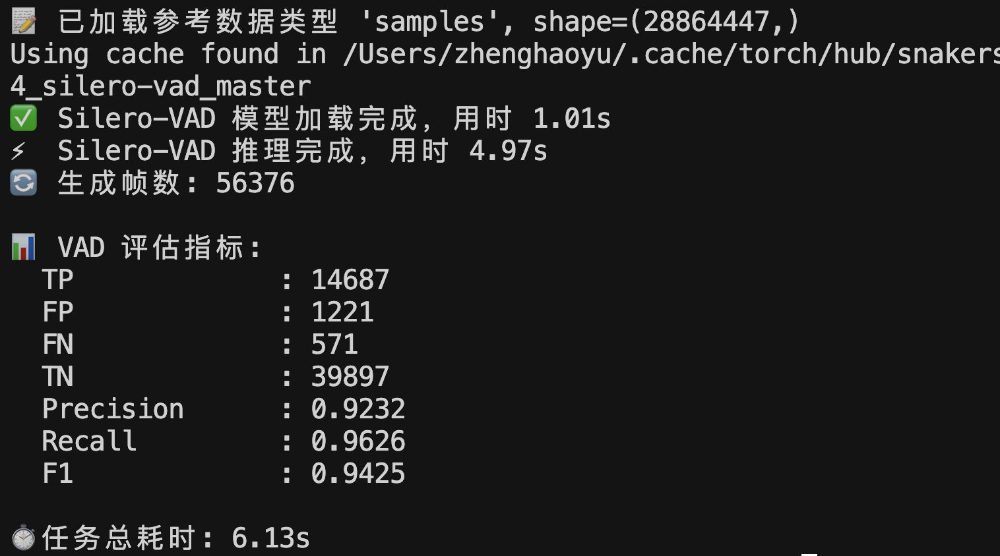
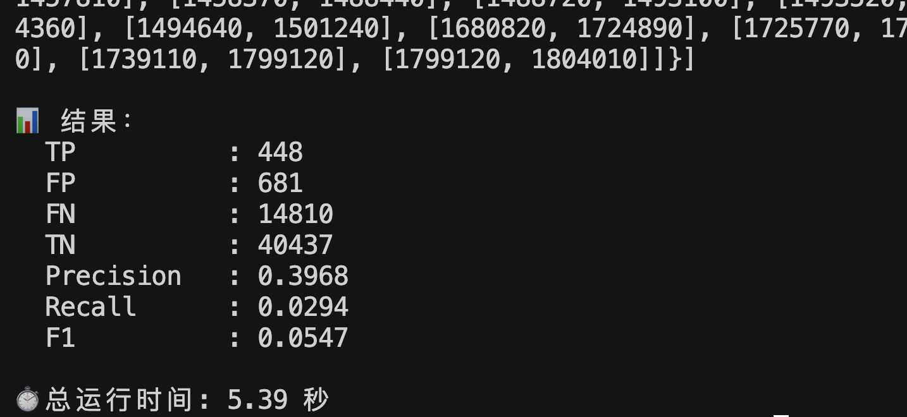
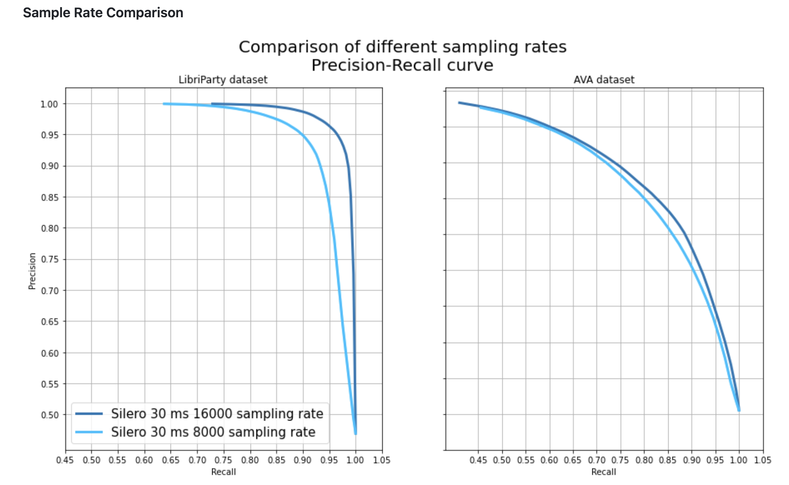
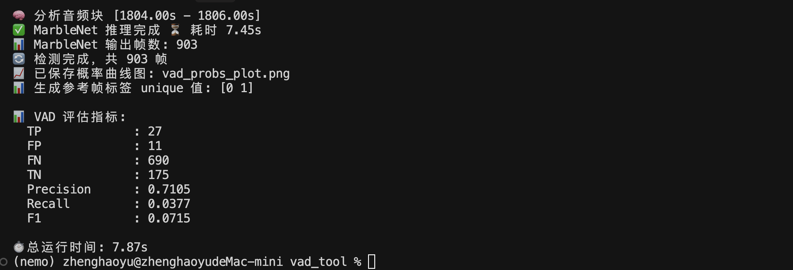
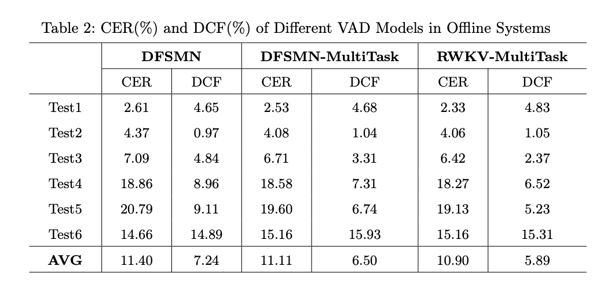
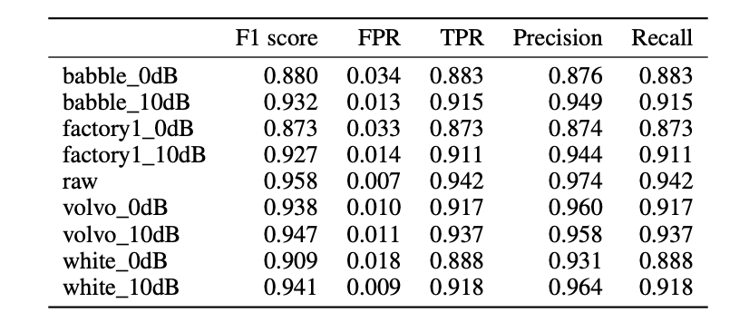
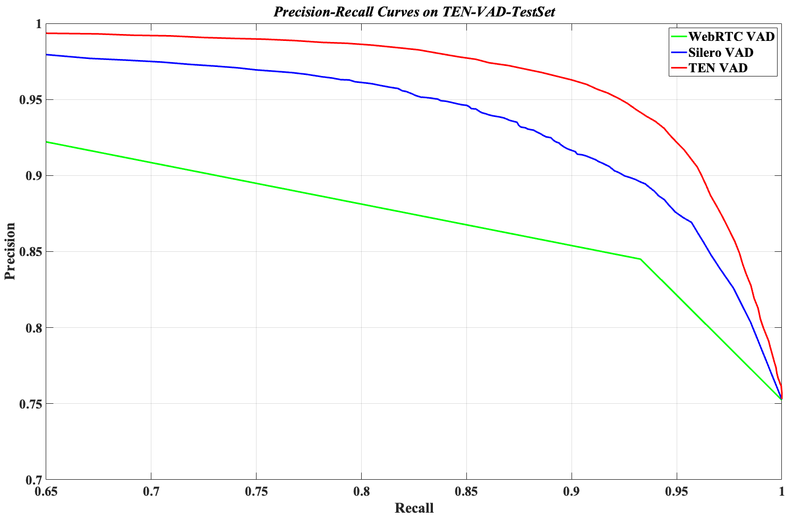
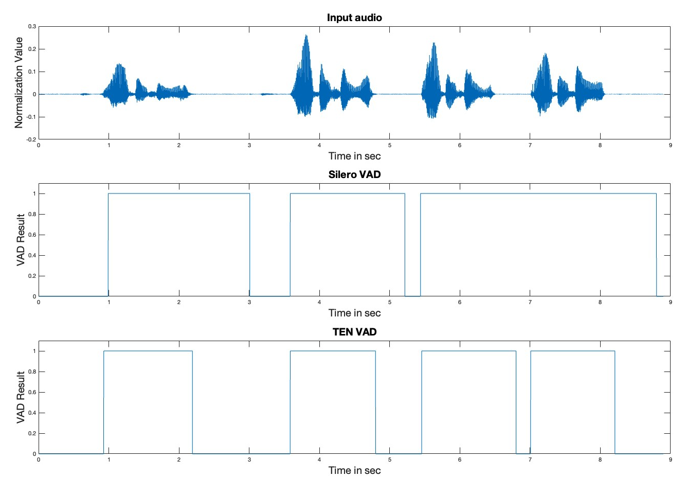
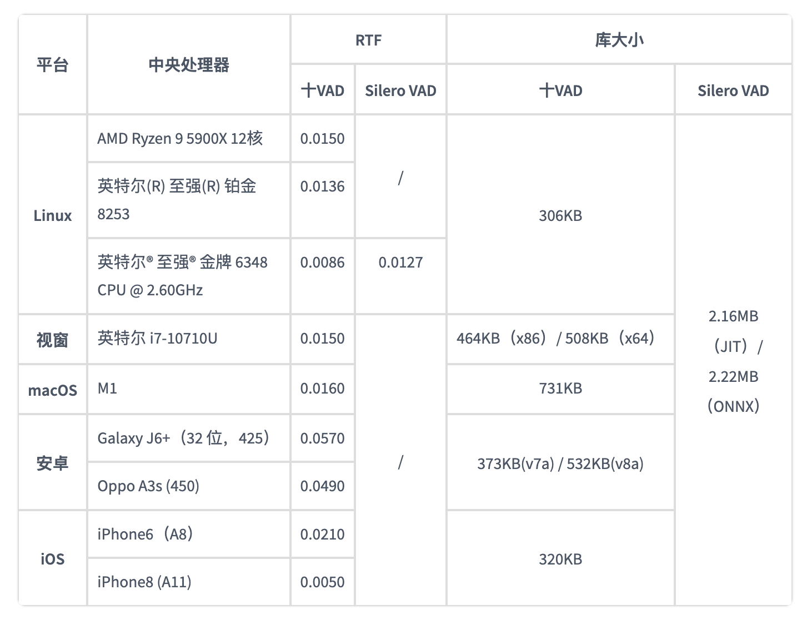

 Silero VAD、FSMN-VAD、WebRTC VAD、Cobra VAD、MarbleNet VAD、TEN‑VAD、JaVAD、SG‑VAD

| 模型名称              | 开发方                                  | 主要特性                                                                                                                                  | 性能表现                                                                                                                                                             | 部署方式                                                                                                                         | 许可协议            | 适用场景                                         | 精确率 (Precision) |
| ----------------- | ------------------------------------ | ------------------------------------------------------------------------------------------------------------------------------------- | ---------------------------------------------------------------------------------------------------------------------------------------------------------------- | ---------------------------------------------------------------------------------------------------------------------------- | --------------- | -------------------------------------------- | --------------- |
| **Silero VAD**    | Silero Team                          | - 支持 8kHz/16kHz - 支持 PyTorch 和 ONNX - 轻量级（\~2MB） - 多语言支持（6000+）                                                              | - 在 AliMeeting、Earnings21、AISHELL-4 等多个数据集上表现优异 - 在 ESC-50 噪声数据集上准确率达 0.61                                                                                    | - 支持 CPU 和 GPU - 可在浏览器中运行（通过 ONNX）                                                                                        | MIT 许可          | - 呼叫中心 - 嵌入式设备 - 浏览器端应用                |                 |
| **FSMN-VAD**      | FunASR / ModelScope                  | - 基于 FSMN 架构 - 支持流式和离线模式 - 模型小巧（\~1.6MB） - 训练于中文语料，具备抗噪能力                                                                    | - 在 Mac M1 Pro 上处理 70 秒音频仅需 0.6 秒 - 实时因子（RTF）可达 0.0077                                                                                                        | - 支持 ONNX Runtime - 可在 macOS 上运行                                                                                          | MIT 许可          | - 中文语音处理 - 嵌入式系统 - 实时语音识别              |                 |
| **WebRTC VAD**    | Google                               | - 基于传统信号处理 - 支持 8kHz、16kHz、32kHz、48kHz 采样率 - 低延迟，适用于实时通信                                                                        | - 在多种数据集上表现稳定 - 但在噪声环境下性能有限                                                                                                                                   | - C/C++ 实现 - 可通过 Python 接口使用（如 py-webrtcvad）                                                                              | BSD 许可          | - 实时通信（VoIP） - 嵌入式系统                      |                 |
| **Cobra VAD**     | Picovoice                            | - 基于深度学习 - 提供多平台 SDK（Python、Node.js、Android、iOS 等） - 支持本地运行，保护用户隐私                                                              | - 准确率是 WebRTC VAD 的两倍 - 对背景噪声具有较强的鲁棒性                                                                                                                         | - 跨平台支持 - 可嵌入移动设备和浏览器                                                                                                     | 商业许可（需联系销售）     | - 企业级应用 - 隐私敏感场景 - 移动和嵌入式设备            |                 |
| **MarbleNet VAD** | NVIDIA                               | - 基于 CNN 的轻量级模型（91.5K 参数） - 多语言支持（中、英、法、德、俄、西） - 每 20ms 输出一次语音概率                                                                | - 训练时加入了白噪声和真实世界噪声扰动 - 在多种语言和噪声环境下表现良好                                                                                                                        | - 支持 PyTorch 和 ONNX - 可在多种平台部署                                                                                            | NVIDIA 开源模型许可协议 | - 多语言语音识别 - 嵌入式系统 - 噪声环境下的语音检测         |                 |
| **TEN‑VAD**       | TEN‑framework                        | - - 基于深度学习，专为企业级对话系统设计，具备高精度的帧级语音检测能力      - 检测延迟极低，远优于 WebRTC 和 Silero VAD，快速捕捉语音 → 非语音切换     - 极轻量，库体积小（几十 KB 到几百 KB）、计算资源占用低 | - 与 Silero VAD 比延迟降低 ~32%；       - 能检测动静切换几乎“零延迟”； - 高噪声条件下准确率和误警率表现良好                                                                                     | - - 提供跨平台支持：C 语言库覆盖 Linux/macOS/Windows/Android/iOS，同时提供 Python 绑定（Linux）及 WebAssembly（WASM）版本      - 支持 ONNX，便于嵌入各类引擎和设备 | Apache开源许可证     | -适合对延迟敏感的实时对话系统，如智能客服、语音助手、会议记录等，跨平台部署能力强。   |                 |
| **JaVAD**         | skrbnv                               | - 基于卷积网络，滑窗处理 mel‑spectrogram，速度快   - 包含噪声鲁棒训练数据，人为标注 YouTube/旧电影场景，提升应对嘈杂环境的表现() - 体积小，核心功能只依赖 PyTorch 和 NumPy，发布为 PyPI 包，方便安装 | - 所有模型均在AVA‑Speech数据集（包含 18.5 小时电影音频）上测评，具备高准确度和全方位的 ROC 曲线表现。 - 在 GPU 上，balanced 模型能在 16 秒内处理 18.5 小时音频，速度非常快。 - precise 版本为性能优先选项，而 tiny 则是低延迟、适合实时流式应用。 | - 使用 PyTorch 实现，提供训练 & 推理脚本，可在低资源设备上部署，如边缘端                                                                                  | MIT 许可          | - 特别适合对资源消耗高度敏感但仍需准确检测的边缘设备场景，如嵌入式、移动端低功耗环境。 |                 |
| **SG‑VAD**        | - Jonathan Svirsky 和 Ofir Lindenbaum | - 使用 Stochastic Gates 机制进行特征选择，将 VAD 视作去噪任务  - 模型尺寸仅 ~7.8 K 参数，结构轻量适合低资源环境                                                         | - 在 AVA‑Speech 上ROC‑AUC ≈ 94.3%，HAVIC ≈ 83.3%   - 比 ResectNet、大型模型精度接近，参数10倍更小                                                                                | - 提供 PyTorch 代码，适合轻量模型部署。（无官方多平台二进制支持）                                                                                       | MIT 许可          | - 适合边缘、低资源设备、科研环境，用于研究和教育；也用于轻量级嵌入式。         |                 |
评价vad模型的指标：
# 📊 VAD 模型性能指标汇总

 1. 精确率 (Precision)
- **中文解释**: 检测为语音的帧中，实际是语音的比例（降低误报）。
- **公式**:  
  $$
  Precision = \frac{TP}{TP + FP}
  $$
  - **TP**: 真阳性（语音检测正确）  
  - **FP**: 假阳性（非语音误检为语音）

---

2. 召回率 (Recall) / 灵敏度 (Sensitivity)
- **中文解释**: 实际语音帧中，被检测出来的比例（降低漏报）。
- **公式**:  
  $$
  Recall = \frac{TP}{TP + FN}
  $$
  - **FN**: 假阴性（语音漏检）

---

 3. F1 分数 (F1 Score)
- **中文解释**: 精确率和召回率的调和平均，用于平衡二者。
- **公式**:  
  $$
  F1 = 2 \cdot \frac{Precision \cdot Recall}{Precision + Recall}
  $$

---

 4. 假警率 (False Alarm Rate, FAR)
- **中文解释**: 实际为非语音帧中，误检为语音的比例。
- **公式**:  
  $$
  FAR = \frac{FP}{FP + TN}
  $$
  - **TN**: 真阴性（无语音检测正确）

---

5. 漏检率 (Miss Rate, MR)
- **中文解释**: 实际语音帧中，未检测出来的比例。
- **公式**:  
  $$
  MR = \frac{FN}{TP + FN}
  $$

---

6. 等错误率 (Equal Error Rate, EER)
- **中文解释**: FAR 和 MR 相等时的错误率，用于评价整体性能。
- **公式**:  
  在 DET 曲线中找到 $FAR = MR$ 时的值。

---

 7. 曲线下面积 (AUC, Area Under Curve)
- **中文解释**: ROC 曲线下的面积，衡量模型对语音/非语音分类的整体能力。
- **公式**:  
  $$
  AUC = \int_{0}^{1} TPR(FPR) \, dFPR
  $$
  - **TPR**: 真阳性率  
  - **FPR**: 假阳性率

---

8. 检测错误权衡 (DET Curve)
- **中文解释**: 以 FAR 和 MR 画出的曲线，直观显示模型错误权衡。
- **公式**:  
  曲线，不是单一公式。

---
	9.CER（Classification Error Rate）

- **中文**：分类错误率
- **公式**：
  CER = (FP + FN) / (TP + TN + FP + FN)
- **解释**：表示错误分类帧所占的比例，值越低说明模型整体分类效果越好。
---
	10.DCF（Detection Cost Function）
- **中文**：检测成本函数
- **公式**：
  DCF = Cmiss * Pmiss * Ptarget + Cfa * Pfa * (1 - Ptarget)
- **解释**：综合考虑漏检和误检代价的评测指标，值越低表示模型检测性能更优。

> 📝 **说明**:  
- VAD（语音活动检测）模型的目标是 **最大化 F1 和 AUC，最小化 FAR 和 MR**。  
- 在实际应用中，**不同场景可能权衡 Precision 和 Recall**。

# 📂 常用 VAD 数据集

 1. TIMIT
- **中文名称**: TIMIT 语料库
- **简介**: 一个包含 630 名说话人的英文语音数据集，涵盖 8 个主要方言区域。
- **特点**:  
  - 精确的逐帧语音标注  
  - 常用于 VAD 和语音识别的基准测试  
- **链接**: [TIMIT 官方](https://catalog.ldc.upenn.edu/LDC93S1)

---

2. AMI Meeting Corpus
- **中文名称**: AMI 会议语料库
- **简介**: 包含真实会议场景的多通道音频数据，适合测试嘈杂环境下的 VAD 性能。
- **特点**:  
  - 包含多人交谈、背景噪声等复杂场景  
  - 适合鲁棒性 VAD 研究  
- **链接**: [AMI Corpus](http://groups.inf.ed.ac.uk/ami/corpus/)

---

3. CHiME
- **中文名称**: CHiME 挑战数据集
- **简介**: 专为噪声鲁棒性语音处理设计，包含各种噪声环境（街道、家居、公交等）。
- **特点**:  
  - 提供多通道录音  
  - 常用于嘈杂环境 VAD 研究  
- **链接**: [CHiME Challenge](https://chimechallenge.github.io/)

---

4. LibriSpeech
- **中文名称**: LibriSpeech 语料库
- **简介**: 从 LibriVox 有声书提取的英语语音数据集。
- **特点**:  
  - 大规模、高质量、公开  
  - 通常用于训练 VAD 模型  
- **链接**: [LibriSpeech](http://www.openslr.org/12/)

---

5. Aurora-2
- **中文名称**: Aurora-2 数据集
- **简介**: 包含数字串语音数据，并加入了多种噪声环境。
- **特点**:  
  - 含有背景噪声（如街道、列车、机场等）  
  - 适合小词汇表 VAD 测试  
- **链接**: [Aurora Project](https://www.elda.org/)

---

6. QUT-NOISE-TIMIT
- **中文名称**: QUT-TIMIT 噪声数据集
- **简介**: 将 TIMIT 数据与多种真实录制的噪声混合，适合评估嘈杂环境 VAD。
- **特点**:  
  - 真实噪声环境  
  - 逐帧标注  
- **链接**: [QUT-NOISE](https://research.qut.edu.au/saivt/databases/qut-noise-timit/)

---

 7. VoxCeleb
- **中文名称**: VoxCeleb 语音数据集
- **简介**: 大规模说话人验证和识别数据集，可用于 VAD 模型预训练。
- **特点**:  
  - 多语言、多说话人  
  - 包含多种噪声和设备差异  
- **链接**: [VoxCeleb](http://www.robots.ox.ac.uk/~vgg/data/voxceleb/)

---

## 📝 备注
- ✅ 以上数据集多数支持 **逐帧语音/非语音标注**，适合作为 **VAD 模型评测标准**。  
- ✅ **TIMIT、QUT-NOISE-TIMIT 和 Aurora-2** 是学术界 VAD 常用的基准测试数据集。

基于公开的测试数据分析每一个vad的优劣：

- Silero v4版本：数据来源：（https://github.com/snakers4/silero-vad/wiki/Quality-Metrics/7a0eb82468f5e58f46c7224a53bc3ec29facbcdd?utm_source=chatgpt.com）

![[image-3.png]]
在 LibriParty 和 AVA 数据集上，Silero v4 相比 v3 在 Precision-Recall 表现上有明显提升，特别是在高 Recall 区域，v4 能保持接近 1 的高 Precision，而 v3 在 Recall 接近 1 时 Precision 出现大幅下降，说明 **v4 在检测更多语音时依然能保持较低误报率**，整体性能更加稳健。
对比 Silero 模型在 16kHz 和 8kHz 采样率下的表现，可以看到两者在 Precision-Recall 曲线上的差距非常小，16kHz 略微优于 8kHz，尤其在 LibriParty 数据集上表现更平滑，说明 **采样率对模型性能影响不大，但高采样率在嘈杂环境下可能更鲁棒**。
Silero 在 LibriParty 和 AVA 数据集上的 Precision-Recall 表现显著优于 Picovoice 和 WebRTC，尤其在高 Recall 区域，Silero 依然保持高 Precision，而其他两者 Precision 大幅下降，说明 **Silero 在高灵敏度和低误检率之间达到了最佳平衡**，在干净和复杂场景下均具优势。
**Silero v4 在干净与复杂环境下的 VAD 检测性能均优于旧版本和其他主流模型，兼顾高灵敏度和低误检率，是当前极具竞争力的轻量级 VAD 解决方案。**

- FSMN-VAD（来源：https://arxiv.org/pdf/2312.14860）

- **实时系统（Real‑time）**：
    - 平均 语音识别错误率（CER）：11.73 %
    - 平均 Detection Cost Function（DCF）：8.33 % 
- **离线系统（Offline）**：
    - 平均 CER：11.40 %
    - 平均 DCF：7.24 %

- WebRTC VAD（来源：https://cs230.stanford.edu/projects_winter_2020/reports/32224732.pdf?utm_source=chatgpt.com）

WebRTC VAD 表现稳健于干净音频 (precision ~0.89/ recall ~0.76)，但在带噪环境中 precision 可达 0.99（0 dB babble），却因 recall 极低（0.45–0.51），导致 F1 值崩溃

- Cobra VAD

**模型本身是闭源的**

- MarbleNet VAD  
- （https://catalog.ngc.nvidia.com/orgs/nvidia/teams/nemo/models/vad_multilingual_marblenet/files）
训练集：Google Speech Command v2 + Freesound  
  ✅ 测试集：AVA–Speech (ALL)  
性能指标：
  TPR @ FPR=0.315 = 0.858 ± 0.016  
 AUROC = 0.858 ± 0.011  
改进版（多语种）：
  TPR = 0.9093  
  AUROC = 0.9112
总结： MarbleNet VAD 在 **标准单语环境** 下表现良好，而 **多语种模型** 在更复杂的场景下性能进一步提高，适合应用于多语言的国际化产品。

- TEN-VAD   数据来源：https://huggingface.co/TEN-framework/ten-vad?utm_source=chatgpt.com

- **TEN‑VAD（红色曲线）** 在整个召回率范围内保持最高的精确率（Precision），曲线最靠近 (1,1) 的理想点，说明它综合了更少的误报和漏检。
- **Silero VAD（蓝色曲线）** 的表现次之，虽然也维持较高精确率，但相比 TEN‑VAD 在高召回率时精度下降更明显。
- **WebRTC VAD（绿色曲线）** 精确率最低，尤其在高召回率 (>0.85) 区间下降严重，说明它容易出现误报。
📊 **结论**：TEN‑VAD 在此测试集上的综合性能**显著优于** Silero 和 WebRTC，是一个更稳健的 VAD 模型。

如上图图所示，TEN VAD 能够快速检测语音到非语音的转换，而 Silero VAD 则存在数百毫秒的延迟，导致人机交互系统的端到端延迟增加。此外，如 6.5 秒到 7.0 秒的音频片段所示，Silero VAD 无法识别相邻语音片段之间的短暂静默。

在五个不同的平台上评估了 RTF（实时因子），每个平台配备了不同的 CPU。TEN VAD 的计算复杂度远低于 Silero VAD，库大小也更小。
**支持的采样率和跳数：**
TEN VAD 以 16kHz 音频输入运行，并可配置跳数（优化帧配置：160/256 个样本 = 10/16ms）。其他采样率必须重新采样至 16kHz。
- Ja-VAD 
没有公开数据

# vad总结
# 🏆 VAD 模型性能排行榜

## 1️⃣ TEN‑VAD
- **简介**：轻量级、高精度 VAD 模型，适合实时语音检测。
- **亮点**：
  - Precision‑Recall 曲线最优，尤其高 Recall 时也能保持高 Precision。
  - 延迟低，库体积小，计算复杂度低，适合实时应用。
- **缺点**：
  - 仅支持 16kHz，其他采样率需重采样。
- **来源**：[HuggingFace TEN‑VAD](https://huggingface.co/TEN-framework/ten-vad?utm_source=chatgpt.com)

---

## 2️⃣ Silero‑VAD v4
- **简介**：开源轻量级 VAD 模型，适配多采样率，适合嵌入式与服务器。
- **亮点**：
  - 在 LibriParty 和 AVA 数据集上性能显著优于 v3。
  - 16kHz 和 8kHz 表现差距小，高采样率在噪声环境更鲁棒。
- **缺点**：
  - 高召回率下，Precision 稍逊于 TEN‑VAD。
- **来源**：[Silero VAD Wiki](https://github.com/snakers4/silero-vad/wiki/Quality-Metrics/7a0eb82468f5e58f46c7224a53bc3ec29facbcdd)

---

## 3️⃣ FSMN‑VAD
- **简介**：面向远场和复杂噪声环境，基于 FSMN 架构的 VAD 模型。
- **亮点**：
  - CER（11.4%–11.7%）、DCF（7.2%–8.3%），在复杂场景中鲁棒性极佳。
- **缺点**：
  - 模型较大，实时性稍差。
- **来源**：[arXiv:2312.14860](https://arxiv.org/pdf/2312.14860)

---

## 4️⃣ MarbleNet VAD
- **简介**：NVIDIA 提供的多语种 VAD 模型，适合国际化产品。
- **亮点**：
  - TPR@FPR=0.315=85.8%，AUROC=0.91，多语种模型性能更高。
- **缺点**：
  - 计算量较大。
- **来源**：[NVIDIA MarbleNet](https://catalog.ngc.nvidia.com/orgs/nvidia/teams/nemo/models/vad_multilingual_marblenet/files)

---

## 5️⃣ WebRTC VAD
- **简介**：经典轻量级 VAD，适合嵌入式设备。
- **亮点**：
  - 干净音频 Precision ~0.89 / Recall ~0.76
  - 极低资源占用
- **缺点**：
  - 噪声环境下 Recall 极低，F1 值崩溃。
- **来源**：[Stanford CS230 Report](https://cs230.stanford.edu/projects_winter_2020/reports/32224732.pdf)

---

## 6️⃣ Cobra VAD
- **简介**：Picovoice 生态内的 VAD 模型。
- **亮点**：
  - 与 Picovoice 堆栈集成，适合语音激活场景。
- **缺点**：
  - 闭源，缺乏公开测试数据。
- **来源**：[Picovoice Cobra](https://picovoice.ai/platform/cobra/)

---

# 📊 综合结论
✅ **最佳综合性能**：TEN‑VAD  
✅ **轻量级最佳**：Silero‑VAD v4  
✅ **多语种支持**：MarbleNet VAD  
✅ **经典嵌入式方案**：WebRTC VAD  

注：whisper中不含vad，许多开源项目增加vad部分，去除噪声，加速推理，并且可以提高准确度。

[^1]: 
