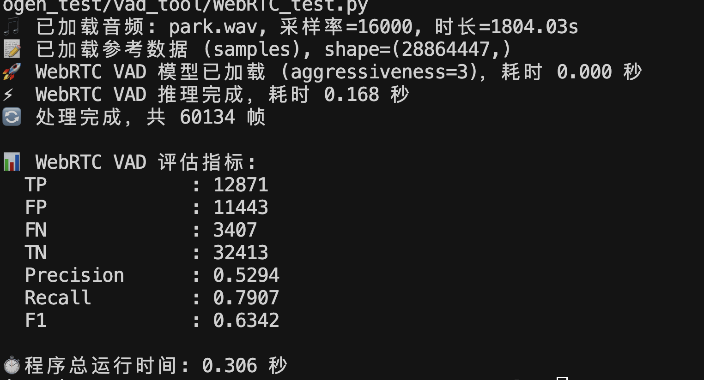
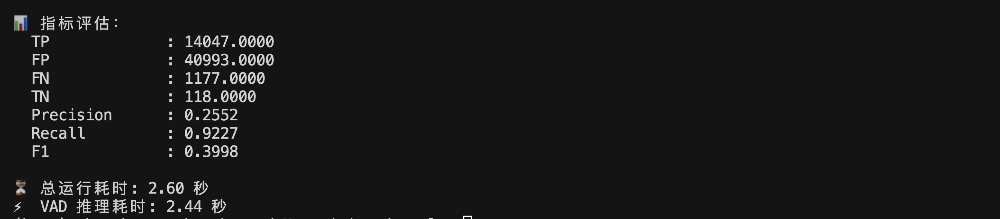

 Silero VAD、FSMN-VAD、WebRTC VAD、Cobra VAD、MarbleNet VAD、TEN‑VAD、JaVAD、SG‑VAD

| 模型名称              | 开发方                                  | 主要特性                                                                                                                                  | 性能表现                                                                              | 部署方式                                                                                                                         | 许可协议            | 适用场景                                       | 精确率 (Precision) |
| ----------------- | ------------------------------------ | ------------------------------------------------------------------------------------------------------------------------------------- | --------------------------------------------------------------------------------- | ---------------------------------------------------------------------------------------------------------------------------- | --------------- | ------------------------------------------ | --------------- |
| **Silero VAD**    | Silero Team                          | - 支持 8kHz/16kHz<br>- 支持 PyTorch 和 ONNX<br>- 轻量级（\~2MB）<br>- 多语言支持（6000+）                                                              | - 在 AliMeeting、Earnings21、AISHELL-4 等多个数据集上表现优异<br>- 在 ESC-50 噪声数据集上准确率达 0.61     | - 支持 CPU 和 GPU<br>- 可在浏览器中运行（通过 ONNX）                                                                                        | MIT 许可          | - 呼叫中心<br>- 嵌入式设备<br>- 浏览器端应用              |                 |
| **FSMN-VAD**      | FunASR / ModelScope                  | - 基于 FSMN 架构<br>- 支持流式和离线模式<br>- 模型小巧（\~1.6MB）<br>- 训练于中文语料，具备抗噪能力                                                                    | - 在 Mac M1 Pro 上处理 70 秒音频仅需 0.6 秒<br>- 实时因子（RTF）可达 0.0077                         | - 支持 ONNX Runtime<br>- 可在 macOS 上运行                                                                                          | MIT 许可          | - 中文语音处理<br>- 嵌入式系统<br>- 实时语音识别            |                 |
| **WebRTC VAD**    | Google                               | - 基于传统信号处理<br>- 支持 8kHz、16kHz、32kHz、48kHz 采样率<br>- 低延迟，适用于实时通信                                                                        | - 在多种数据集上表现稳定<br>- 但在噪声环境下性能有限                                                    | - C/C++ 实现<br>- 可通过 Python 接口使用（如 py-webrtcvad）                                                                              | BSD 许可          | - 实时通信（VoIP）<br>- 嵌入式系统                    |                 |
| **Cobra VAD**(闭源) | Picovoice                            | - 基于深度学习<br>- 提供多平台 SDK（Python、Node.js、Android、iOS 等）<br>- 支持本地运行，保护用户隐私                                                              | - 准确率是 WebRTC VAD 的两倍<br>- 对背景噪声具有较强的鲁棒性                                          | - 跨平台支持<br>- 可嵌入移动设备和浏览器                                                                                                     | 商业许可（需联系销售）     | - 企业级应用<br>- 隐私敏感场景<br>- 移动和嵌入式设备          |                 |
| **MarbleNet VAD** | NVIDIA                               | - 基于 CNN 的轻量级模型（91.5K 参数）<br>- 多语言支持（中、英、法、德、俄、西）<br>- 每 20ms 输出一次语音概率                                                                | - 训练时加入了白噪声和真实世界噪声扰动<br>- 在多种语言和噪声环境下表现良好                                         | - 支持 PyTorch 和 ONNX<br>- 可在多种平台部署                                                                                            | NVIDIA 开源模型许可协议 | - 多语言语音识别<br>- 嵌入式系统<br>- 噪声环境下的语音检测       |                 |
| **TEN‑VAD**       | TEN‑framework                        | - - 基于深度学习，专为企业级对话系统设计，具备高精度的帧级语音检测能力 <br>    - 检测延迟极低，远优于 WebRTC 和 Silero VAD，快速捕捉语音 → 非语音切换<br>    - 极轻量，库体积小（几十 KB 到几百 KB）、计算资源占用低 | - 与 Silero VAD 比延迟降低 ~32%；      <br>- 能检测动静切换几乎“零延迟”；<br>- 高噪声条件下准确率和误警率表现良好      | - - 提供跨平台支持：C 语言库覆盖 Linux/macOS/Windows/Android/iOS，同时提供 Python 绑定（Linux）及 WebAssembly（WASM）版本 <br>    - 支持 ONNX，便于嵌入各类引擎和设备 | Apache开源许可证     | -适合对延迟敏感的实时对话系统，如智能客服、语音助手、会议记录等，跨平台部署能力强。 |                 |

评价vad模型的指标：
# 📊 VAD 模型性能指标汇总

 1. 精确率 (Precision)
- **中文解释**: 检测为语音的帧中，实际是语音的比例（降低误报）。
- **公式**:  
  $$
  Precision = \frac{TP}{TP + FP}
  $$
  - **TP**: 真阳性（语音检测正确）  
  - **FP**: 假阳性（非语音误检为语音）

---

2. 召回率 (Recall) / 灵敏度 (Sensitivity)
- **中文解释**: 实际语音帧中，被检测出来的比例（降低漏报）。
- **公式**:  
  $$
  Recall = \frac{TP}{TP + FN}
  $$
  - **FN**: 假阴性（语音漏检）

---

 3. F1 分数 (F1 Score)
- **中文解释**: 精确率和召回率的调和平均，用于平衡二者。
- **公式**:  
  $$
  F1 = 2 \cdot \frac{Precision \cdot Recall}{Precision + Recall}
  $$

---

 4. 假警率 (False Alarm Rate, FAR)
- **中文解释**: 实际为非语音帧中，误检为语音的比例。
- **公式**:  
  $$
  FAR = \frac{FP}{FP + TN}
  $$
  - **TN**: 真阴性（无语音检测正确）

---

5. 漏检率 (Miss Rate, MR)
- **中文解释**: 实际语音帧中，未检测出来的比例。
- **公式**:  
  $$
  MR = \frac{FN}{TP + FN}
  $$

---

6. 等错误率 (Equal Error Rate, EER)
- **中文解释**: FAR 和 MR 相等时的错误率，用于评价整体性能。
- **公式**:  
  在 DET 曲线中找到 $FAR = MR$ 时的值。

---

 7. 曲线下面积 (AUC, Area Under Curve)
- **中文解释**: ROC 曲线下的面积，衡量模型对语音/非语音分类的整体能力。
- **公式**:  
  $$
  AUC = \int_{0}^{1} TPR(FPR) \, dFPR
  $$
  - **TPR**: 真阳性率  
  - **FPR**: 假阳性率

---

8. 检测错误权衡 (DET Curve)
- **中文解释**: 以 FAR 和 MR 画出的曲线，直观显示模型错误权衡。
- **公式**:  
  曲线，不是单一公式。

---
	9.CER（Classification Error Rate）

- **中文**：分类错误率
- **公式**：
  CER = (FP + FN) / (TP + TN + FP + FN)


> 📝 **说明**:  
- VAD（语音活动检测）模型的目标是 **最大化 F1 和 AUC，最小化 FAR 和 MR**。  
- 在实际应用中，**不同场景可能权衡 Precision 和 Recall**。

# 📂 常用 VAD 数据集

 1. TIMIT
- **中文名称**: TIMIT 语料库
- **简介**: 一个包含 630 名说话人的英文语音数据集，涵盖 8 个主要方言区域。
- **特点**:  
  - 精确的逐帧语音标注  
  - 常用于 VAD 和语音识别的基准测试  
- **链接**: [TIMIT 官方](https://catalog.ldc.upenn.edu/LDC93S1)

---

2. AMI Meeting Corpus
- **中文名称**: AMI 会议语料库
- **简介**: 包含真实会议场景的多通道音频数据，适合测试嘈杂环境下的 VAD 性能。
- **特点**:  
  - 包含多人交谈、背景噪声等复杂场景  
  - 适合鲁棒性 VAD 研究  
- **链接**: [AMI Corpus](http://groups.inf.ed.ac.uk/ami/corpus/)

---

3. CHiME
- **中文名称**: CHiME 挑战数据集
- **简介**: 专为噪声鲁棒性语音处理设计，包含各种噪声环境（街道、家居、公交等）。
- **特点**:  
  - 提供多通道录音  
  - 常用于嘈杂环境 VAD 研究  
- **链接**: [CHiME Challenge](https://chimechallenge.github.io/)

---

4. LibriSpeech
- **中文名称**: LibriSpeech 语料库
- **简介**: 从 LibriVox 有声书提取的英语语音数据集。
- **特点**:  
  - 大规模、高质量、公开  
  - 通常用于训练 VAD 模型  
- **链接**: [LibriSpeech](http://www.openslr.org/12/)

---

5. Aurora-2
- **中文名称**: Aurora-2 数据集
- **简介**: 包含数字串语音数据，并加入了多种噪声环境。
- **特点**:  
  - 含有背景噪声（如街道、列车、机场等）  
  - 适合小词汇表 VAD 测试  
- **链接**: [Aurora Project](https://www.elda.org/)

---

6. QUT-NOISE-TIMIT
- **中文名称**: QUT-TIMIT 噪声数据集
- **简介**: 将 TIMIT 数据与多种真实录制的噪声混合，适合评估嘈杂环境 VAD。
- **特点**:  
  - 真实噪声环境  
  - 逐帧标注  
- **链接**: [QUT-NOISE](https://research.qut.edu.au/saivt/databases/qut-noise-timit/)

---

 7. VoxCeleb
- **中文名称**: VoxCeleb 语音数据集
- **简介**: 大规模说话人验证和识别数据集，可用于 VAD 模型预训练。
- **特点**:  
  - 多语言、多说话人  
  - 包含多种噪声和设备差异  
- **链接**: [VoxCeleb](http://www.robots.ox.ac.uk/~vgg/data/voxceleb/)


下面是我自己实际测试得到的数据：
使用的是公开标注的数据集：https://github.com/jtkim-kaist/VAD?tab=readme-ov-file
其中中文数据集：https://modelscope.cn/datasets/speech_tts/AISHELL-3/summary?utm_source=chatgpt.com
运行环境：macos M4
```markdown
| 英文缩写 (Short Name) | 中文名称                   | 解释                                                                                     |
|------------------------|----------------------------|------------------------------------------------------------------------------------------|
| TP                     | 真阳性 (True Positive)     | 预测为“语音”，且实际上是“语音”的帧数                                                   
| FP                     | 假阳性 (False Positive)    | 预测为“语音”，但实际上是“静音”的帧数                                                   
| FN                     | 假阴性 (False Negative)    | 预测为“静音”，但实际上是“语音”的帧数                                                   
| TN                     | 真阴性 (True Negative)     | 预测为“静音”，且实际上是“静音”的帧数                                                   
| Precision              | 精确率                     | 在所有预测为“语音”的帧中，预测正确的比例（TP ÷ (TP + FP)）                              
| Recall                 | 召回率                     | 在所有真实“语音”帧中，被正确预测的比例（TP ÷ (TP + FN)）                                 
| F1                     | F1 分数                    | 精确率和召回率的调和平均，综合反映模型表现（2 × Precision × Recall ÷ (Precision + Recall))|
```

| vad model     | TP    | FP    | FN    | TN    | Precision | Recall | F1     | 延迟     |
| ------------- | ----- | ----- | ----- | ----- | --------- | ------ | ------ | ------ |
| Silero‑VAD v4 | 14687 | 1221  | 571   | 39897 | 0.9232    | 0.9626 | 0.9425 | 4.97s  |
| FSMN-VAD      | 448   | 681   | 14810 | 40437 | 0.3968    | 0.0294 | 0.0547 | 5.47s  |
| WebRTC VAD    | 12871 | 11443 | 3407  | 32413 | 0.5294    | 0.7907 | 0.6342 | 0.168s |
| MarbleNet VAD | 27    | 11    | 690   | 175   | 0.7105    | 0.0377 | 0.0715 | 7.45s  |
| TEN-VAD       | 14047 | 40993 | 1177  | 118   | 0.2552    | 0.9227 | 0.3998 | 2.44s  |

这是Silero‑VAD v4  测试的结果


FSMN-VAD：（因为这个模型是对中文比较友好，使用的数据集是没有中文内容，所以效果比较差）

WebRTC:

MarbleNet VAD（默认是用于短音频）：

TEN-VAD:


总结

| **排名**   | **模型**                                  | **优势**                                 | **劣势**        |
| -------- | --------------------------------------- | -------------------------------------- | ------------- |
| 🥇 **1** | **Silero‑VAD**                          | **Precision, Recall, F1 全面领先**，误报少，漏检少 | 延迟比 WebRTC 略高 |
| 🥈 **2** | **WebRTC VAD**                          | 延迟极低，简单快速，适合实时应用                       | 精度一般，误报较多     |
| 🥉 **3** | TEN-VAD                                 | 召回率高（漏检少），适合希望不漏任何语音的场景                | 精度差，误报非常多     |
|          | FSMN-VAD（使用的数据集不是中文，中文数据集效果好，其他数据集效果很差） | **性能全面崩盘**（几乎漏检所有语音）                   | 精度低、召回率低      |
| 🚫       | MarbleNet VAD                           | 准确性极低，几乎检测不到语音                         | 推理时间还特别长      |


注：whisper中不含vad，许多开源项目增加vad部分，去除噪声，加速推理，并且可以提高准确度。

[^1]: 
